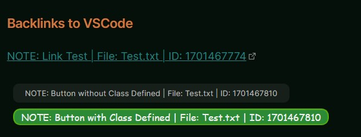
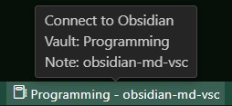
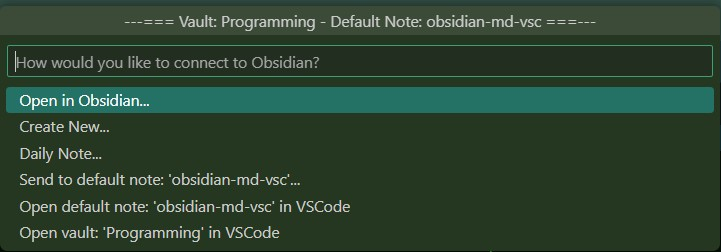
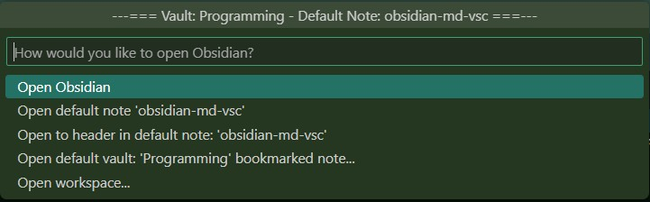
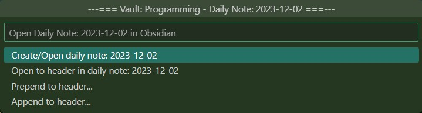
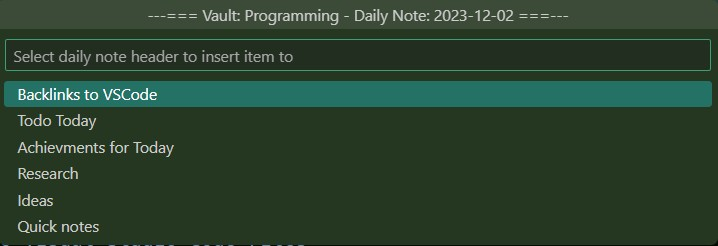

# Obsidian MD
Connect to Obsidian directly from within Visual Studio Code.

> Obsidian is a powerful and extensible knowledge base
that works on top of your local folder of plain text files. You can get more information and download it from [here](https://obsidian.md/)

## Features
- Open Obsidian saved Workspaces.
- Open your vaults Bookmarked notes.
- Send information directly to your defined default note.
- Send information directly to your daily note.
- Send Text, Inline and Fenced Code Blocks, Comments, List Items, Blockquotes, Tasks, and Callouts to your Default and Daily notes.
- Open your entire vault in Visual Studio Code.
- Send [Backlinks](#backlinks) to your projects code files.

## Requirments

- [Obsidian.MD](https://obsidian.md/) A second brain, for you, forever.

- [Obsidian Advanced Uri](https://github.com/Vinzent03/obsidian-advanced-uri) Plugin, you can find the documentation [here](https://vinzent03.github.io/obsidian-advanced-uri/). This is required to communicate with Obsidian from Visual Studio Code.

## Not required but recommended
- [Obsidian Buttons](https://github.com/shabegom/buttons) Plugin. For creating Visual Studio Code backlink buttons.

## Settings.json

- Default Vault - Sets the default vault to connect with.
- Default Note - Sets the default note within the default vault to connect with.
- Default Vault Path - The default vaults path.
- Button Class - Class to use with the Buttons plugin (Optional) default is set to none
- Backlink Prefix - List of possible prefix's to the backlink description
  - Feel free to add, edit or remove the defaults to suit your needs

Note: The `Default Vault, Default Note and Default Vault Path` settings are created automatically when running the commands...

`Obsidian MD: Set Default Vault and Note (Global)`

and for workspace settings...

`Obsidian MD: Set Default Vault and Note (Workspace)`

## Commands
The following commands are available from the command pallette: (Windows: CTRL+Shift+P or F1) (Mac: CMD+Shift+P)

#### Obsidian MD: Connect with Obsidian (Default Hotkey - ALT+O)
This is the command to open the menu system to communicate with Obsidian. See the [The command Structure Outline](#the-command-structure-outline) for details. If this is the first time it is run, and the default vault and default note are not defined in the settings, the command `Obsidian MD: Set Default Vault and Note (Global)` will be run prompting you for the default vault and default note. These are required by the extension to operate so please set them when prompted.

#### Obsidian MD: Set Default Vault and Note (Global)
Sets your default vault and the default note within that vault in your global settings.json file.

#### Obsidian MD: Set Default Vault and Note (Workspace)
Sets your default vault and the default note within that vault in your workspace settings.json file. This will override your global settings allowing you to define a specific vault and default note on a per project basis.

## Backlinks
Backlinks are links created in your default note or daily note in Obsidian that link back to a specific line within any file in your Visual Studio Code project. When inserting a backlink you will first be prompted for a decription prefix (These can be edited in the extensions settings). You can press Esc for no prefix if you wish. Next you will be prompted for a text desription which will be used as the text for the backlink (This is required). The backlinks should be placed inside a comment so as to not cause code errors.

- Backlink buttons are supported if you have the Buttons plugin installed
  - You can set a default class for the buttons in the extensions settings
- Backlinks are automatically updated when saving a file in Visual Studio Code
  - The line number is updated to the correct location if it has moved to a new line
- Backlinks are automatically removed when deleting a file in Visual Studio Code
  - The Backlinks in Obsidians default note and/or daily note are removed
  - Note that only the Backlink text line(s) are removed, this may leave extra blank lines depending on the documents content
- Backlinks are automatically updated when renaming a file in Visual Studio Code
  - The file name in the Backlink will be updated to the new file name

### Example of Backlinks Text Inserted Into Obsidian Default/Daily Note Files

Link:

`[NOTE: Some Description | File: Example.txt | ID: 1701328121](vscode://file/c:/programming/code/my_code/vscode/test-folder/Example.txt:1)`

Button:

```button
name NOTE: Some Description | File: Example.txt | ID: 1701325515
type link
action vscode://file/c:/programming/code/my_code/vscode/test-folder/Example.txt:1
```
Button with Class Defined:

```button
name NOTE: Some Description | File: Example.txt | ID: 1701325515
type link
class buttonclassname
action vscode://file/c:/programming/code/my_code/vscode/test-folder/Example.txt:1
```
In the examples you are free to edit the prefix (NOTE:) and the description (Some Description).

Do **Not** edit the `File: Example.txt` portion. That will be updated automatically if the file is renamed.

Do **Not** edit the `ID: 1701328121` portion. This is a unique Identifier used by the extension to maintain the Backlink.

Do **Not** edit the `File: vscode://file...` portion. This is the actual link to the Visual Studio Code files line for the Backlink. This is maintained by the extension.

### Examples of Backlinks Text Inserted Into Visual Studio Code Files

Note: Link and Buttons Text Format is Identical:

`NOTE: Some Description | File: obsidian-md-vsc | ID: 1701328992` (Default Note)

`NOTE: Some Description | File: 2023-11-30 | ID: 1701330039` (Daily Note)

#### Example Backlinks Screenshot from Obsidian
Backlink Examples from Obsidian...



## Status Bar Button Screenshots
Without Default Vault and Note set... (will run the command `Obsidian MD: Set Default Vault and Note (Global)`)


With Default Vault and Note set... (will run the command `Obsidian MD: Connect with Obsidian` (Default Hotkey - ALT+O))



## Command Menu Screenshots
Command Menu Home... To activate, run the command `Obsidian MD: Connect with Obsidian` (Default Hotkey - ALT+O)



Open in Obsidian Submenu...



Daily Note Submenu...



Daily Note Prepend/Append to Header Submenu...



## The Command Structure Outline

Note: Some menu commands will only appear under specific conditions, for example...

All the `Insert selected text...` items will not be shown when no text is selected

- Open in Obsidian...
	- Open Obsidian
	- Open note (Default Note)
	- Open to header in (Default Note)
	- Open (Default Vault) bookmarked note...
	- Open workspace
- Create New...
	- Create new note
	- Create new note from from current file or selection
- Daily Notes...
	- Create/Open daily note
	- Open to header in daily note
	- Prepend to header...
		- Insert text
		- Insert selected text (Will only appear when text is selected)
		- Insert selected text as inline code block (Will only appear when text is selected)
		- Insert selected text as fenced code block (Will only appear when text is selected)
		- Insert Comment
		- Unnumbered list item
		- Numbered list item
		- Blockquote
		- Insert task
		- Insert Callout
		- Insert VSCode backlink
		- Insert VSCode backlink button (Will only appear when Buttons plugin is installed)
	- Append to header...
		- Insert text
		- Insert selected text (Will only appear when text is selected)
		- Insert selected text as inline code block (Will only appear when text is selected)
		- Insert selected text as fenced code block (Will only appear when text is selected)
		- Insert Comment
		- Unnumbered list item
		- Numbered list item
		- Blockquote
		- Insert task
		- Insert Callout
		- Insert VSCode backlink
		- Insert VSCode backlink buttom (Will only appear when Buttons plugin is installed)
- Send to note (Default Note)...
	- Prepend to header...
		- Insert text
		- Insert selected text (Will only appear when text is selected)
		- Insert selected text as inline code block (Will only appear when text is selected)
		- Insert selected text as fenced code block (Will only appear when text is selected)
		- Insert Comment
		- Unnumbered list item
		- Numbered list item
		- Blockquote
		- Insert task
		- Insert Callout
		- Insert VSCode backlink
		- Insert VSCode backlink buttom (Will only appear when Buttons plugin is installed)
	- Append to header...
		- Insert text
		- Insert selected text (Will only appear when text is selected)
		- Insert selected text as inline code block (Will only appear when text is selected)
		- Insert selected text as fenced code block (Will only appear when text is selected)
		- Insert Comment
		- Unnumbered list item
		- Numbered list item
		- Blockquote
		- Insert task
		- Insert Callout
		- Insert VSCode backlink
		- Insert VSCode backlink buttom (Will only appear when Buttons plugin is installed)
- Open note: (Default Note) in VSCode
- Open vault: (Default Vault) in VSCode

## Release Notes
See the [Release Notes](RELEASE.md) for details.

